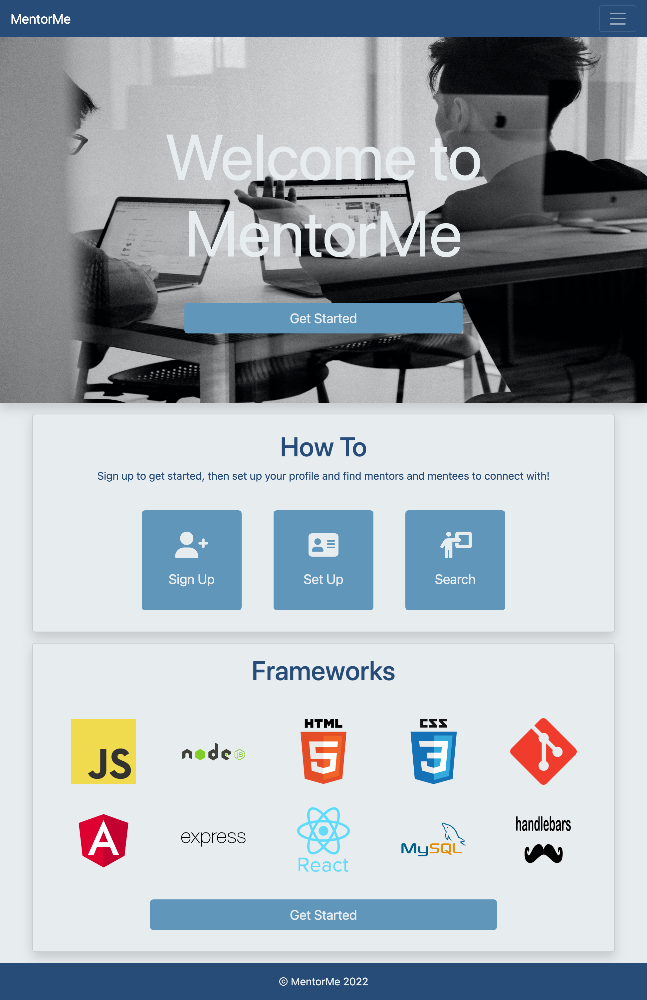
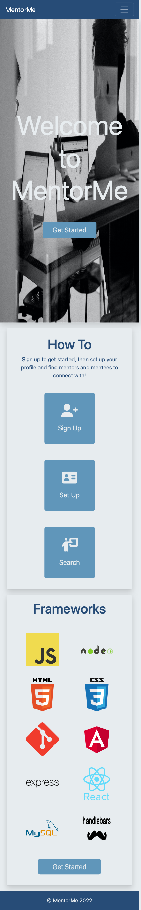

# coding-mentoring 

Platform to match coding mentors with coding mentees

[Deployed URL](https://lit-atoll-12366.herokuapp.com/)

## Team members

- [Katarzyna Jaromin-Kaliciak](https://github.com/katarzynajk)
- [Abdirahman Osman](https://github.com/AOsman0)
- [Ricky Palmer](https://github.com/SkyIsNotGreen)
- [Amelie Pira](https://github.com/Am0031)
- [Aisha Saleh](https://github.com/Saleha22)
- [Cherelle Simpson](https://github.com/C-Sim)

## Technologies

- Handlebars
- bcrypt
- Express-session
- Connect-session-sequelize
- MySQL2
- Sequelize
- Express
- Node
- Nodemon
- dotenv
- Heroku
- HTML
- CSS
- Bootstrap

## Screenshots

<details>
<summary>Homepage - Desktop Viewport</summary>



</details>

<details>
<summary>Homepage - Mobile Viewport</summary>



</details>
</br>

## User Story

```md
AS A coding enthusiast
I WANT access to a mentor who can coach me, a mentee who I can coach or peers with similar interests
SO THAT I can enhance my skills and build my network
```

## Acceptance Criteria

```md
GIVEN a full-stack MentorMe application
WHEN I visit the site for the first time
THEN I am presented with the homepage, navigation links for the homepage and mentor search; and the option to log in
WHEN I click on the homepage or mentor search options
THEN I am taken to these pages
WHEN I click on any other links in the navigation
THEN I am prompted to either sign up or sign in
WHEN I choose to sign up
THEN I am prompted to create a username and password and enter some basic profile information
WHEN I click on the sign-up button
THEN my user credentials are saved and I am logged into the site
WHEN I revisit the site at a later time and choose to sign in
THEN I am prompted to enter my email and password
WHEN I am signed in to the site
THEN I see navigation links for the homepage, my dashboard, and the option to log out and am able to edit my personal information
WHEN I am logged in as a Mentee
THEN I can view profiles of Mentors and other Mentees and connect with them via email, view and edit the frameworks I am interested in learning, view my partnerships with Mentors and the tasks they have assigned to me
WHEN I am logged in as a Mentor
THEN I can view profiles of Mentees and connect with them via email, view and edit the frameworks I am interested in coaching and view my partnerships with Mentees and the tasks they I have assigned to them. I can also search the library of tasks, filter them to show the tasks that I have created, and create additional tasks to add to the library
```
